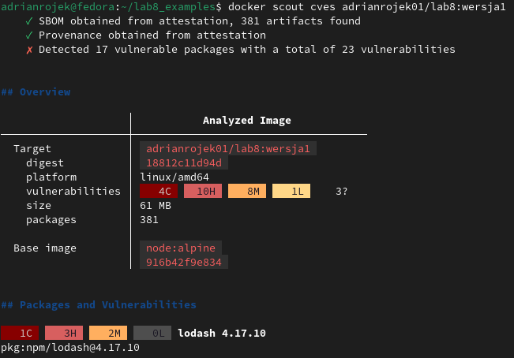
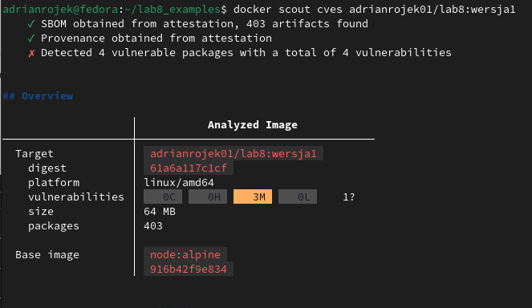

<h1 align="center"> Sprawozdanie laboratorium 8 </h1>

Na początku należało zbudować obraz z wykorzystanim poniższej komendy:

```
bash docker buildx build -q -f Dockerfile_classic -t adrianrojek01/lab8:wersja1 --sbom=true --provenance=mode=max --push .
```

Kolejnym krokiem było zweryfikowanie podatności na zagrożenia obrazu przy użyciu polecenia: 

```
bash docker scout cves adrianrojek01/lab8:wersja1
```

Obraz posiada sporo podatności co można zaobserwować na poniższym screenie: 


Konieczne było usunięcie zagrożeń typu 'high' oraz 'critical'. Z opisu będącego wynikiem komendy okazało się iż przyczyną zagrożeń były wersje bibliotek JavaScript. Dodatkowo powyższe polecenie dostarczyło niezbędnych informacji, z których dowiedziałem się które pakiety są przyczyną zagrożeń, dlatego niezbędnym krokiem była ich modyfikacja w pliku package.json

Po zastosowaniu się do wskazówek plik package.json wygląda następująco:


Ponowne zweryfikowanie poprawności obrazu:


